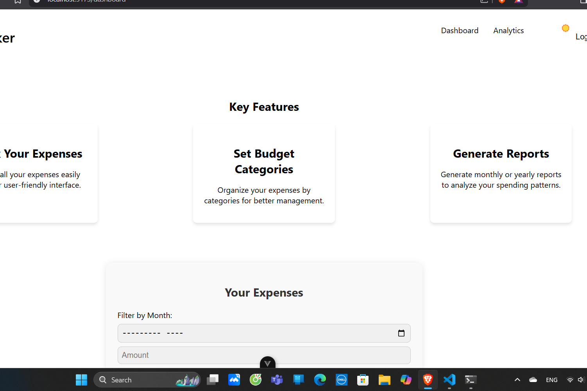

# Expense Tracker

A web-based application to track your expenses, set budgets, and categorize your spending. Built with Flask for the backend and Vue.js for the frontend, using SQLite for data storage.

## Features

- **User Authentication**: Register, login, and logout functionality.
- **Expense Tracking**: Record expenses and categorize them.
- **Category Management**: Add and delete expense categories.
- **Analytics & Reports**: View monthly expense summaries and generate reports.

## Installation

### Backend (Flask)

1. Install the required packages:

   ```bash
   cd backend
   pip install -r requirements.txt



